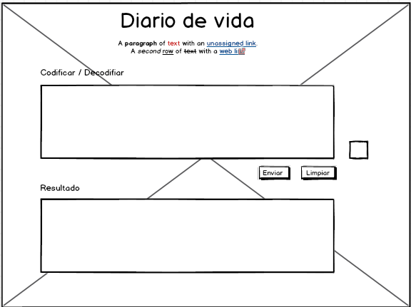

## CODIFICA POTTER
Este proyecto lo realice pensando en mi hermano, debido a que cuando eramos adolecentes el escribia sus secretos en su agenda de harry potter y yo se la sacaba siempre para leer lo que escribia.

Esta pensado en usuarios que deseen cifrar o decifrar informacion personal,  es una especie de diario de vida que no guarda la informacion, pero el usuario podria en su defecto guardar la informacion cifrar.
#### Definición del producto
Los principale usuarios son jovenes  y adulto joven que utilicen diarios de vidas o agendas.

- Este  producto  esta resolviendo sus problemas de privacidad, ya que hay  usuarios que ocupan word para escribir sus secretos o experiencias de vida y no quieren que otras personas sepan y el cifrado viene a ayudarlos en caso de que se les pueda quedar abierto el computador o su agenda.

## UX
Diseño de experiencia de usuario

- Ideación
- Prototipado (sketching) 
- Testeo e Iteración

Primero realice mi prototipo en papel para tener una idea de como distribuir los espacios.

## Checklist
Esta sección está para ayudarte a llevar un control de los objetivos de aprendizaje y las funcionalidades.

Estas instrucciones te permitirán obtener una copia del proyecto en funcionamiento en tu máquina local para propósitos de desarrollo y pruebas.

Mira Deployment para conocer como desplegar el proyecto.

Pre-requisitos clipboard
Que cosas necesitas para instalar el software y como instalarlas

Da un ejemplo
Instalación wrench
Una serie de ejemplos paso a paso que te dice lo que debes ejecutar para tener un entorno de desarrollo ejecutandose

Dí cómo será ese paso

Da un ejemplo
Y repite

hasta finalizar
Finaliza con un ejemplo de cómo obtener datos del sistema o como usarlos para una pequeña demo

Ejecutando las pruebas gear
Explica como ejecutar las pruebas automatizadas para este sistema

Analice las pruebas end-to-end nut_and_bolt
Explica que verifican estas pruebas y por qué

Da un ejemplo
Y las pruebas de estilo de codificación keyboard
Explica que verifican estas pruebas y por qué

Da un ejemplo
Deployment package
Agrega notas adicionales sobre como hacer deploy

Construido con hammer_and_wrench
Menciona las herramientas que utilizaste para crear tu proyecto

Dropwizard - El framework web usado
Maven - Manejador de dependencias
ROME - Usado para generar RSS
Contribuyendo paperclips
Por favor lee el CONTRIBUTING.md para detalles de nuestro código de conducta, y el proceso para enviarnos pull requests.

Wiki book
Puedes encontrar mucho más de cómo utilizar este proyecto en nuestra Wiki

Versionado pushpin
Usamos SemVer para el versionado. Para todas las versiones disponibles, mira los tags en este repositorio.

Autores black_nib
Menciona a todos aquellos que ayudaron a levantar el proyecto desde sus inicios

Andrés Villanueva - Trabajo Inicial - villanuevand
Fulanito Detal - Documentación - fulanitodetal
También puedes mirar la lista de todos los contribuyentes quíenes han participado en este proyecto.

Licencia page_facing_up
Este proyecto está bajo la Licencia (Tu Licencia) - mira el archivo LICENSE.md para detalles

Expresiones de Gratitud gift
Comenta a otros sobre este proyecto loudspeaker
Invita una cerveza beer a alguien del equipo.
Da las gracias públicamente nerd_face.
etc.
