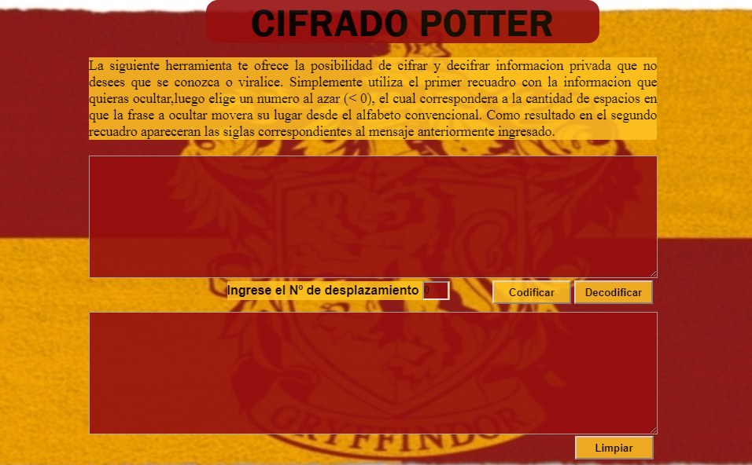

## CODIFICA POTTER
Este proyecto lo realice pensando en mi hermano, debido a que cuando eramos adolecentes el escribia sus secretos en su agenda de harry potter y yo se la sacaba siempre para leer lo que escribia.

Esta pensado en usuarios que deseen cifrar o decifrar informacion personal,  es una especie de diario de vida que no guarda la informacion, pero el usuario podria en su defecto guardar la informacion cifrar.
#### Definición del producto
Los principale usuarios son jovenes  y adulto joven que utilicen diarios de vidas o agendas.

- Este  producto  esta resolviendo sus problemas de privacidad, ya que hay  usuarios que ocupan word para escribir sus secretos o experiencias de vida y no quieren que otras personas sepan y el cifrado viene a ayudarlos en caso de que se les pueda quedar abierto el computador o su agenda.

## UX
Diseño de experiencia de usuario

- Ideación
- Prototipado (sketching) 
- Testeo e Iteración

Primero realice mi prototipo en papel para tener una idea de como distribuir los espacios.

Luego hice el prototipo de baja calidad.

y finalmente realice el de alta, pero sin funcionalidad, solo en tema de diseño.

- Al realizar testeos con familiares y compañeras pude realizar los cambios necesarios para que se vea mas amigable con el publico objetivo, llegando al siguiente resultado.

## Realizacion de proyecto
Para la realizacion del proyecto utilice 
- HTML
- CSS
- JAVASCRIPT
- CIPHER

## Test

- Se realizaron test de la funcionalidad de cipher el cual en primera instancia arrojo errores que fueron corregidos.

## Funcionalidad

Se debe ingresar una letra, texto o frase en el primer recuadro, luego ingresar el numero de desplazamiento, el cual corresponde a la cantidad de veces que se desplazara una letra, al realizar click en codificar nos dara como resultado una palabra cifrada,
y al hacer click en decifrar nos  volvera al resultado ingresado primeramente, para  finalizar es posible volver a utilizar presionando el boton limpiar.
